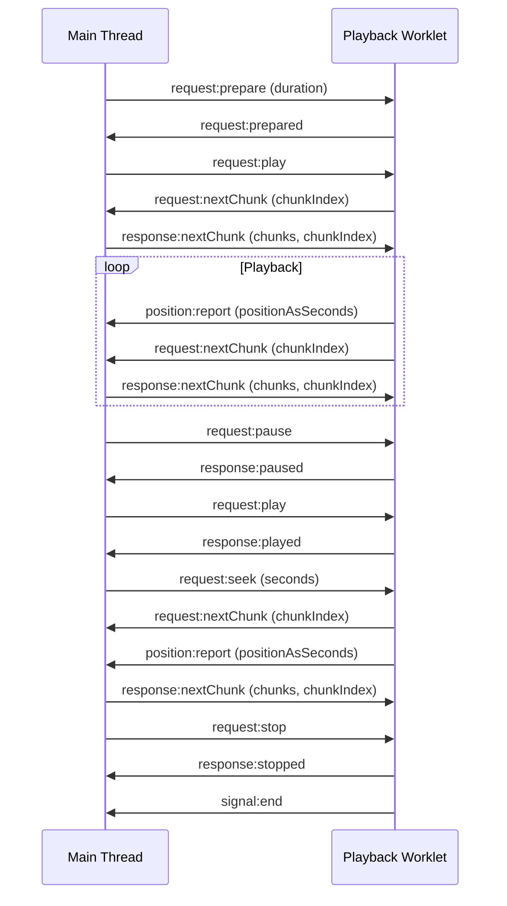
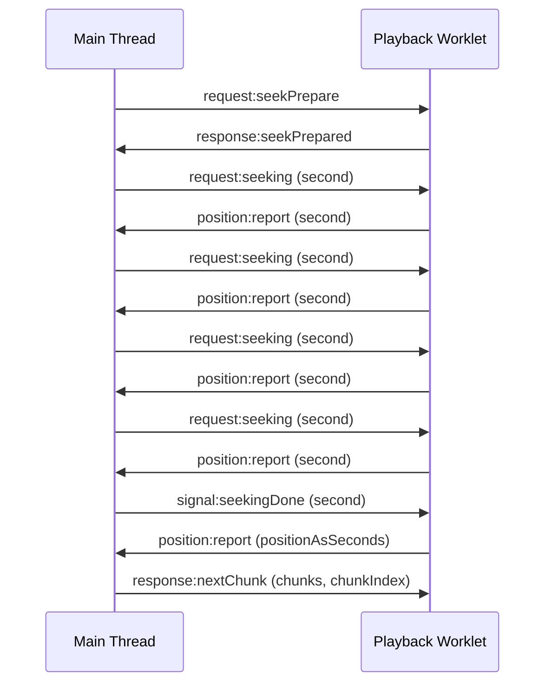

# Native-Worklet Protocol

_This is an overview docs, for more detailed one with some examples, please see `playback-worklet/readme.md`_

This protocol allows cross-platform playback/multitracking by using files located outside the webview sandbox as the streaming source.

The main idea here is the webview's ability to request chunks when it needed. With vanilla web audio API, we're restricted by its playback time and the stream source must be pre-configured.

An example implementation in typescript (only the audio worklet part) can be viewed in the `playback-worklet` folder at the root of this directory.

_Note: this protocol requires that you keepalive the worklet node._

## Overview

Let's say you're working on a cross-platform app -- be it with react native, MAUI, flutter, and the need arises that you need to playback multiple audio sources simultaneously. Unfortunately if you were to do multi-tracking, you would need to read bytes and combine the audio chunks manually, which is a total chore when you have to do that using native APIs for the `x` platforms you are supporting.

This protocol defines the core communication flow for play, pause, seek, and stop.

## Events

### 1. Preparing

> request:prepare, response:prepared

Prepare must first be called in order to prepare the worklet node for playback. This could be setting up the appropriate listeners and/or sending dynamic configurations for the internal buffering requirements. Whatever it is, this lifecycle is where you set things otherwise not possible via the constructor call up, for example, the duration of the audio.

### 2. Chunks Request 

> request:nextChunk, response:nextChunk

The beating heart of this protocol. The audio worklet should call this based on some internal checks, and the main thread should asynchronously deposit new chunks via the response. The worklet thread should use the `chunkIndex` specified in the response object and forward its internal pointers as appropriate.

### 3. Playing

> request:play, response:played

Tells the worklet to begin playing the loaded chunks.

### 4. Position Reporting

> position:report

The worklet reports its current audio position as it plays using this event. The main thread can do whatever it needs with this information. 

This is more flexible that the standard web audio api's `context.currentTime` as you now have full control of the forward rate. For example, if you're implementing an audio processing pipeline requiring interactive real-time timestretching, `position:report` allows you to continue using the audio thread as the source of truth for the current time, while giving you full control of how much to forward it by and when.

### 5. Pausing

> request:pause, response:paused

Tells the worklet to pause playing. This does not stop the worklet. 

### 6. Seeking

> request:seek, request:nextChunk, position:report

Seeking is a little bit more involved as we need to convert seek time to the proper chunk index, call `request:nextChunk` with the index and lock the audio thread from playing until the new chunk is playing because otherwise you may not read the correct data chunk when the audio plays.

For more responsiveness, you may call `position:report` as soon as the seek request is received.

_Notice, there is no `response` for seeking here because `seeking` operation essentially is requesting the audio thread to move its pointer to a new position and reset its internal chunking. This pointer reset is encoded already in the `request:nextChunk` request to the main thread_

### 7. Stopping

> request:stop, response:stopped

Move the audio state to a stopped state and clear all internal buffers. The only way to make the audio output anymore data is to call `request:prepare` again.

### 8. Ending

> signal:end

Signal the main thread that the audio thread can not play anymore data because it has reached the end of the audio based on some internal calculation. This event is optional. If your audio is continuous and plays forever, you do not need to implement this event.

## Extensions Example

The protocol can be easily extended (I think...). For example, it currently supports a single seek event, but in audio players like spotify, you may to "soft" seek (seeking without actually requesting chunks) as the user holds down the mouse and drag, then eventually request playback chunk when the mouse is released. For this, you can add additional events like so

## Further Documentation

For a more detailed specification of the Native-Worklet Protocol, including API descriptions, data formats, error handling, and performance considerations, please refer to our [detailed specification document](link-to-detailed-spec.md).

