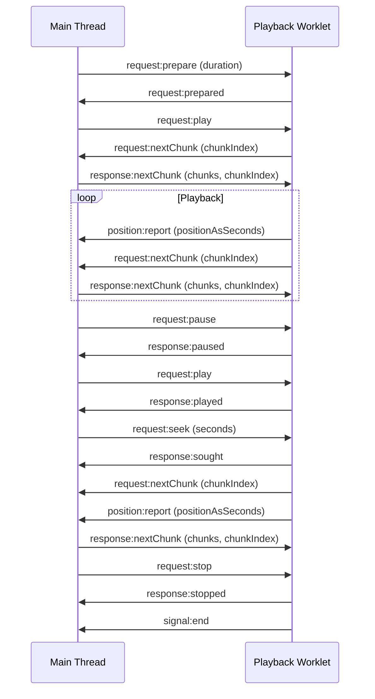

# Native-Webview Audio Processing Protocol

This protocol allows cross-platform playback/multitracking by using files located outside the webview sandbox as the streaming source.

The main idea here is the webview's ability to request chunks when it needed. With vanilla web audio API, we're restricted by its playback time and the stream source must be pre-configured.

